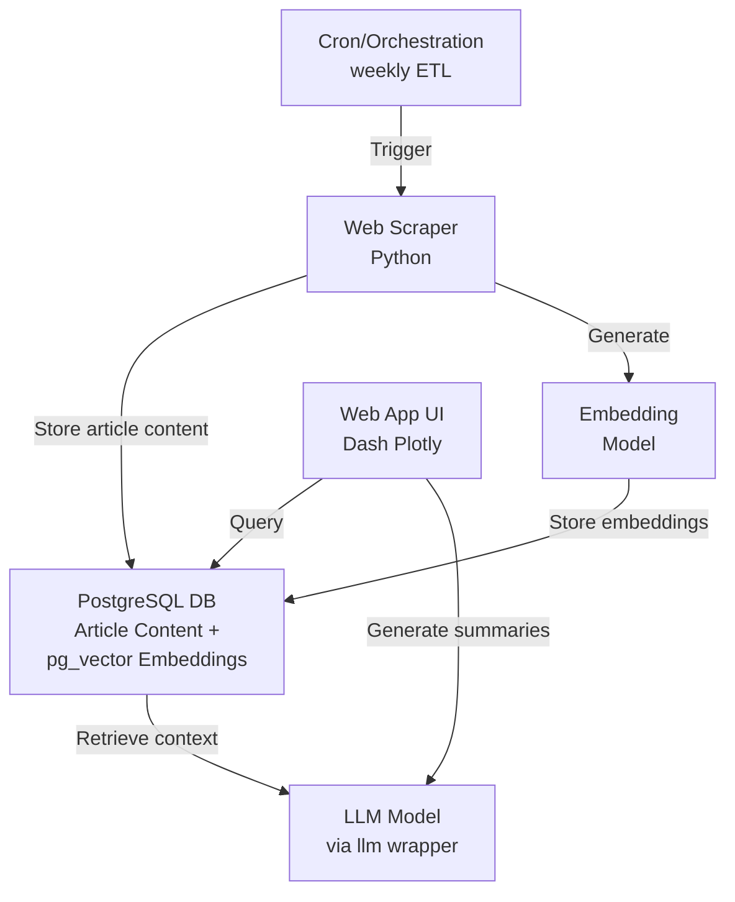

# The Economizer - Project Masterplan

## 1. Project Overview

"The Economizer" is a personal web application designed to generate summaries of the latest weekly editions of The Economist magazine. The application will leverage AI models for text processing and provide a chatbot interface for querying specific information from the articles.

### Core Problem
Save time reading The Economist by providing targeted summaries and answers to specific questions about the content.

### Target Users
Personal use only (proof-of-concept stage).

## 2. System Architecture



> **Note**: PostgreSQL serves dual purposes - storing both the original article content and the vector embeddings in separate tables within the same database. Cron jobs will handle the regular ETL processes, with future plans to potentially migrate to Prefect for more sophisticated orchestration.

## 3. Core Technologies

### Development Environment
- Docker & Docker Compose for containerization
- Python 3.12 as the primary programming language
- PyCharm Pro 2024 IDE for development

### Backend Components
- **Web Scraping**: Python scripts with authentication for The Economist website
- **Database**: PostgreSQL with pg_vector extension for vector embeddings
- **Embeddings**: Sentence-Transformers for generating text embeddings
- **AI Model Integration**: Simon Willison's LLM wrapper (https://github.com/simonw/llm)
- **Summarization Model**: Open-source, lightweight model from Hugging Face
- **Scheduling**: Basic cron job for weekly updates

### AI Model Recommendations

#### Hardware Considerations
Running on a MacBook Pro 2017 with:
- 2.3 GHz Dual-Core Intel Core i5 processor
- Intel Integrated Graphics
- 16 GB 2133 MHz LPDDR3 memory

**Optimization Priority**: Performance and ease of integration over accuracy for the POC phase.

#### Embedding Models
Optimizing for: lightweight, CPU-friendly, fast inference on older hardware

**Top 3 Embedding Model Options:**
1. **Sentence-Transformers all-MiniLM-L6-v2** (Recommended)
   - Pros: Very lightweight (80MB), runs well on CPU, fast inference
   - Cons: Fixed 384-dimension embeddings, moderate accuracy
   
2. **BERT-tiny embeddings**
   - Pros: Extremely lightweight (17MB), fastest inference on CPU
   - Cons: Lower accuracy, less semantic richness
   
3. **GloVe embeddings**
   - Pros: Non-neural network approach, extremely efficient on CPU
   - Cons: Less contextual understanding, older technology

#### Summarization Models
Optimizing for: CPU-friendly, minimal memory footprint, quick response time

**Top 3 Summarization Model Options:**
1. **Phi-2** (Recommended)
   - Pros: Only 2.7B parameters, exceptional performance-to-size ratio, runs on CPU
   - Cons: Smaller context window (2048 tokens)

2. **TinyLlama-1.1B-Chat**
   - Pros: Ultra-compact at 1.1B parameters, designed for resource-constrained environments
   - Cons: Limited reasoning capabilities, struggles with complex instructions

3. **BART-base-cnn**
   - Pros: Task-specific for summarization, smaller than BART-large, fast inference
   - Cons: Less flexible than instruction-tuned models

> **Recommendation:** For your MacBook Pro 2017 hardware constraints, use **all-MiniLM-L6-v2** for embeddings and **Phi-2** for summarization. This combination will provide reasonable performance without overwhelming your CPU or memory resources. Both models are widely used, well-documented, and optimized for inference on CPU.

> **Future State:** When migrating to AWS, consider upgrading to more powerful models like **all-mpnet-base-v2** for embeddings and **Llama-3-8B-Instruct** or **Mixtral-8x7B** for summarization to improve accuracy while leveraging cloud GPU resources.

### Frontend Components
- **Web Framework**: Dash Plotly for Python-based web interface
- **UI Design**: Simple chatbot interface with ability to view original articles

## 4. Feature Implementation Plan

### Phase 1: Content Acquisition
- Implement web scraper for The Economist using Python
- Set up authentication mechanism using subscription credentials
- Create extractor for individual article content
- Implement weekly content update process via cron job

### Phase 2: Data Processing
- Set up PostgreSQL with pg_vector extension
- Implement text embedding generation using Sentence-Transformers
- Store article content and embeddings in PostgreSQL
- Create indexing system for efficient retrieval

### Phase 3: RAG Implementation
- Integrate LLM wrapper for model access
- Implement RAG pipeline:
  - Query processing
  - Vector search for relevant content
  - Context preparation
  - Response generation

### Phase 4: UI Development
- Create simple chatbot interface with Dash Plotly
- Implement query input and response display
- Add original article viewing capability
- Basic styling and user experience

## 5. Learning Goals Integration

The project structure specifically addresses these learning goals:

1. **RAG Implementation**
   - Complete end-to-end implementation of a Retrieval-Augmented Generation system
   - Practical understanding of context retrieval and generation

2. **Vector Database Usage**
   - Hands-on experience with PostgreSQL pg_vector extension
   - Real-world implementation of vector similarity search

3. **Text Embeddings**
   - Understanding embedding models and their role in RAG systems
   - Practical knowledge of embedding storage and retrieval

4. **Open Model Integration**
   - Experience with integrating open-source models via the LLM wrapper
   - Model selection and evaluation for summarization tasks

## 6. Implementation Details

### PostgreSQL Schema Design
```sql
-- Articles table
CREATE TABLE articles (
    id SERIAL PRIMARY KEY,
    title TEXT NOT NULL,
    content TEXT NOT NULL,
    url TEXT NOT NULL,
    publication_date DATE NOT NULL,
    issue_id TEXT NOT NULL,
    created_at TIMESTAMP WITH TIME ZONE DEFAULT CURRENT_TIMESTAMP
);

-- Embeddings table
CREATE TABLE embeddings (
    id SERIAL PRIMARY KEY,
    article_id INTEGER REFERENCES articles(id),
    embedding vector(384),  -- Dimension depends on embedding model
    created_at TIMESTAMP WITH TIME ZONE DEFAULT CURRENT_TIMESTAMP
);

-- Create index for vector similarity search
CREATE INDEX ON embeddings USING ivfflat (embedding vector_cosine_ops);
```

### Web Scraping Approach
1. Authenticate with The Economist website
2. Retrieve weekly edition main page
3. Extract individual article URLs
4. Fetch and parse article content
5. Store in PostgreSQL database

### RAG Pipeline Flow
1. User submits query via chatbot interface
2. Query is transformed into embedding vector
3. Vector similarity search retrieves relevant article segments
4. Retrieved content forms context for LLM prompt
5. LLM generates summary/answer based on context
6. Response displayed to user with source article links

### Embedding Update Process
1. New articles scraped weekly
2. Content processed through embedding model
3. New embeddings stored in database with article reference
4. Vector index automatically updated

## 7. Deployment Strategy

For the proof-of-concept phase:
- Local development and deployment
- Docker Compose for container orchestration
- Manual triggering of weekly updates (with option to automate via cron)
- All components run on local machine

## 8. Future Extensions

Once the proof-of-concept is working:
1. Add structured interface for pre-defined query categories
2. Implement visualization of topic distribution
3. Upgrade to more sophisticated orchestration with Prefect
4. Add notification system for new content
5. Expand to other news sources
6. Implement history tracking of queries and responses
7. **AWS Migration**: Move from local development to AWS hosting
   - Utilize cloud GPU resources for more powerful models
   - Upgrade to more accurate models (Llama-3-8B, Mixtral-8x7B)
   - Implement auto-scaling for handling larger content volumes
   - Set up proper CI/CD pipeline for deployment

## 9. Technical Considerations

### Hardware Constraints
- Optimize for MacBook Pro 2017 (2.3 GHz Dual-Core Intel Core i5, 16GB RAM)
- Monitor memory usage during model inference
- Implement batch processing for large document sets to avoid memory issues
- Consider model quantization techniques to reduce memory footprint

### Security
- Store credentials securely (environment variables)
- Implement basic authentication for web interface if needed
- Ensure secure local storage of content

### Performance
- Prioritize model loading time and inference speed over accuracy for POC
- Optimize embedding storage and retrieval with appropriate pg_vector indexing
- Consider article chunking strategies to improve relevance in RAG pipeline
- Implement caching mechanisms for frequent queries
- Use async processing where appropriate to maintain UI responsiveness

### Maintenance
- Regular updates to dependencies
- Monitoring of The Economist website structure for scraping adjustments

## 10. Next Steps

1. Set up Docker development environment
2. Create basic scraper for The Economist content
3. Implement PostgreSQL with pg_vector storage
4. Set up embedding pipeline
5. Select and integrate summarization model
6. Develop simple chatbot UI
7. Build end-to-end RAG pipeline
8. Test with real queries
9. Iterate based on performance and usability
